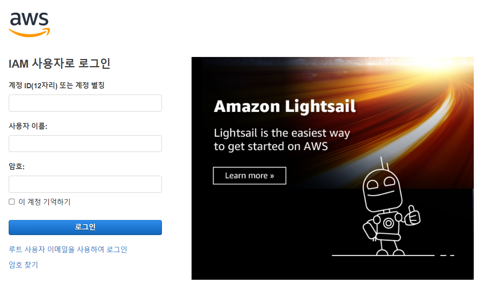
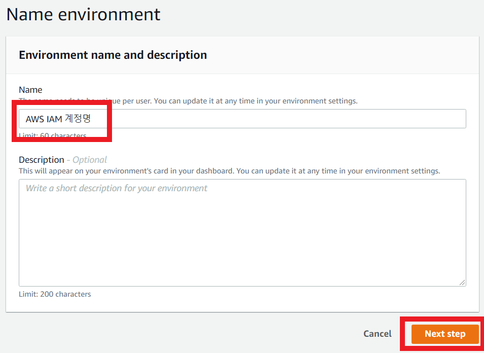
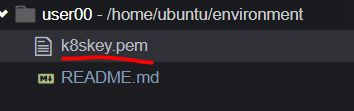
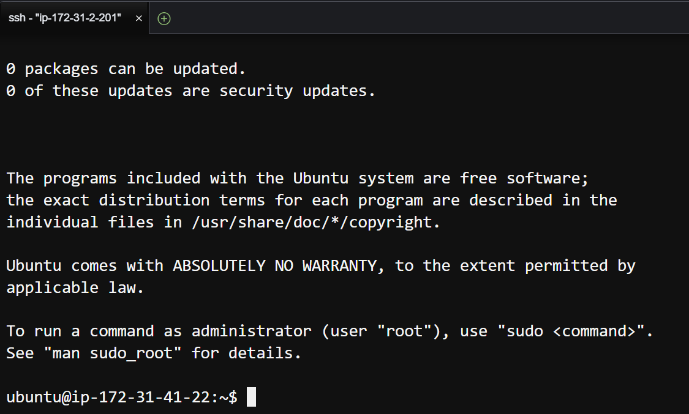
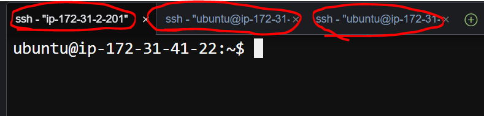

# Task 1 - aws cloud 9  

### aws 의 Cloud9 서비스를 사용하여 실습에서 사용할 IDE 환경을 구축  
#
1. 제공된 링크로 접속합니다.


2. 제공받은 계정정보로 로그인합니다.


우측 상단 지역을 클릭하고 서울을 클릭합니다.

3. 상단 검색창에 Cloud9 을 검색하고 Cloud9 서비스를 클릭합니다.


4. Create environment 를 클릭합니다.


5. Name란에 본인의 aws IAM 계정명을 입력하고 Next step 을 클릭합니다.



6. Configure settings 에서 Instance type 을 t3.small 을 선택하고, Platform의 Ubuntu server 선택 후 Next step 버튼을 클릭합니다.
그리고 선택한 내용 확인 후 Create environment 버튼 클릭합니다.

<br/>

7. 제공받은 pem 파일을 Cloud 환경에서 좌측상단 File - Upload Local Files 를 클릭하여 해당 파일을 업로드합니다.




8. 해당명령으로 key 파일의 권한을 변경합니다.

```
chmod 600 k8skey.pem
```

9. 해당 명령으로 master 노드에 접속합니다.
```
ssh -i k8skey.pem <master ip>
```


10. +버튼을 클릭하고 터미널을 새로 엽니다.


11. 9~10번과정을 참고하여 worker1, 2 노드에도 접속합니다.


